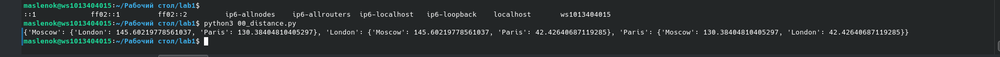

# Python. Лабораторная работа №1

## Памятка для работы с git

#### 1. git init [название проекта]
Создаёт новый локальный репозиторий с заданным именем.

#### 2. git clone [url-адрес]
Скачивает репозиторий вместе со всей его историей изменений.

#### 3. git add [файл]
Индексирует указанный файл для последующего коммита.

#### 4. git commit -m "[сообщение с описанием]"
Фиксирует проиндексированные изменения и сохраняет их в историю версий.

#### 5. git push [удалённый репозиторий] [ветка]
Загружает все изменения локальной ветки в удалённый репозиторий.

#### 6. git pull
Загружает историю из удалённого репозитория и объединяет её с локальной.

## Задание

0. Есть словарь координат городов, составте словарь расстояний между ними.
   
1. Выведите на консоль значение прощади этого круга с точностю до 4-х знаков после запятой.
   Если точка point лежит внутри того самого круга (центр в начале координат (0, 0), radius = 42),
   то выведите на консоль True, Или False, если точка лежит вовне круга. Если точка point_2 лежит внутри круга (radius = 42), то выведите на консоль True,
   Или False, если точка лежит вовне круга.
   
2. Расставьте знаки операций "плюс", "минус", "умножение" и скобки
   между числами "1 2 3 4 5" так, что бы получилось число "25".
   
3. Выведите на консоль с помощью индексации строки, последовательно:
   первый фильм
   последний
   второй
   второй с конца
   
4. Выведите на консоль рост отца в формате: Рост отца - ХХ см.
   Выведите на консоль общий рост вашей семьи как сумму ростов всех членов: Общий рост моей семьи - ХХ см.
   
5. Посадите медведя (bear) между львом и кенгуру и выведите список на консоль.
   Добавьте птиц из списка birds в последние клетки зоопарка и выведите список на консоль.
   Уберите слона и выведите список на консоль.
   Выведите на консоль в какой клетке сидит лев (lion) и жаворонок (lark).
   
6. Распечатайте общее время звучания трех песен: 'Halo', 'Enjoy the Silence' и 'Clean' в формате: Три песни звучат ХХХ.XX минут.
   Распечатайте общее время звучания трех песен: 'Sweetest Perfection', 'Policy of Truth' и 'Blue Dress': А другие три песни звучат ХХХ минут.
   
7. Нужно его расшифровать и вывести на консоль в удобочитаемом виде.
   
8. Создайте множество цветов, произрастающих в саду и на лугу. Выведите на консоль все виды цветов. Выведите на консоль те, которые растут и там и там.
   Выведите на консоль те, которые растут в саду, но не растут на лугу. Выведите на консоль те, которые растут на лугу, но не растут в саду.
   
9. Создайте словарь цен на продкты следующего вида (писать прямо в коде).
   
10. Рассчитать на какую сумму лежит каждого товара на складе, например для ламп.
    Вывести стоимость каждого вида товара на складе: один раз распечать сколько всего столов и их общая стоимость, и т.д. на складе.
    

## Список использованных источников:

1. [Matplotlib cheatsheets and handouts](https://matplotlib.org/cheatsheets/)
2. [Markdown Cheat Sheet](https://www.markdownguide.org/cheat-sheet/)
3. [Writing mathematical expressions](https://docs.github.com/en/get-started/writing-on-github/working-with-advanced-formatting/writing-mathematical-expressions)