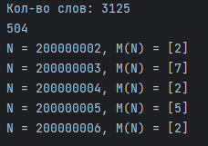

# Python. Лабораторная работа №2

## Задание

1. Иван составляет таблицу кодовых слов для передачи сообщений, каждому сообщению соответствует своё кодовое слово. 
В качестве кодовых слов Иван использует все пятибуквенные слова в алфавите {A, B, C, D, E}, удовлетворяющие такому условию: 
кодовое слово не может начинаться с буквы E и заканчиваться буквой A. Сколько различных кодовых слов может использовать Иван?
2. Сколько единиц содержится в двоичной записи значения выражения: 4^511 + 2^511 - 511
3. Пусть M(N)   — произведение 5 наименьших различных натуральных делителей натурального числа N, не считая единицы. Если у числа N меньше 5 таких делителей, то M(N) считается равным нулю.
Найдите 5 наименьших натуральных чисел, превышающих 200 000 000, для которых 0 < M(N) < N. В ответе запишите найденные значения M(N)  в порядке возрастания соответствующих им чисел N.

## Результаты вычислений

## Список использованных источников:

1. [Matplotlib cheatsheets and handouts](https://matplotlib.org/cheatsheets/)
2. [Markdown Cheat Sheet](https://www.markdownguide.org/cheat-sheet/)
3. [Writing mathematical expressions](https://docs.github.com/en/get-started/writing-on-github/working-with-advanced-formatting/writing-mathematical-expressions)
