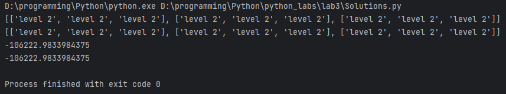

# Python. Лабораторная работа №3

## Задание

Напишите две функции для решения задач своего 
варианта - с использованием рекурсии и без.

## Результаты вычислений

## Список использованных источников:

1. [ChatGPT](https://chatgpt.com/)
2. [Stack Overflow](https://stackoverflow.com/)
3. [Рекурсивная функция в python](https://pythonru.com/osnovy/rekursiya-python)
4. [Как работает рекурсия – объяснение в блок-схемах и видео - Хабр](https://habr.com/ru/articles/337030/)
