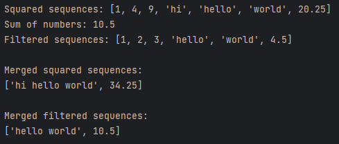

# Python. Лабораторная работа №5

## Задание

Создать генератор для объединения последовательностей по заданной стратегии. 
Сверните возвращемые последовательности в зависимости от типа данных в них.

## Описание проделанной работы
1. Был реализован генератор merge_sequences, 
   который принимает список элементов и объединяет их в зависимости от их типа.
2. Список элементов sequences был обработан с использованием функций map, reduce, filter. 
   Результаты сохранены и выведены на экран.
3. Обработанные последовательности переданы в генератор merge_sequences, 
   который объединяет данные по их типам. 
   Результаты объединения выведены на экран.
## Результаты вычислений

## Список использованных источников:

1. [ChatGPT](https://chatgpt.com/)
2. [Stack Overflow](https://stackoverflow.com/)
3. [Генераторы Python. Их создание и использование](https://pythonist.ru/generatory-python-ih-sozdanie-i-ispolzovanie/)
