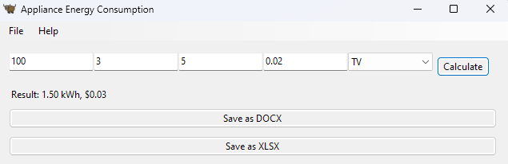

# Python. Лабораторная работа №6

## Задание

По своему варианту задания создайте пакет, содержащий 3 модуля, и подключите его к основной программе.
Основная программа должна предоставлять:
графический пользовательский интерфейс с возможностями ввода требуемых параметров и отображения результатов расчёта,
возможность сохранить результаты в отчёт формата .doc или .xls (например, пакеты python-docx и openpyxl).## Результаты вычислений

## Результаты вычислений

## Список использованных источников:

1. [ChatGPT](https://chatgpt.com/)
2. [Stack Overflow](https://stackoverflow.com/)
3. [Your first Toga app](https://toga.readthedocs.io/en/latest/tutorial/tutorial-0.html)
