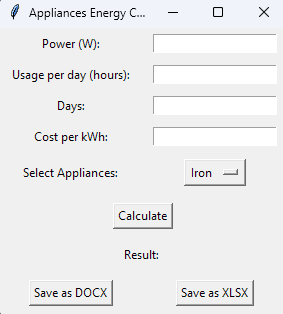

# Python. Лабораторная работа №7

## Задание

Перепишите свой вариант ЛР №6 с использованием классов и объектов. Задание то же, вариант GUI фреймворка возьмите следующий по списку. Для успешной сдачи в коде должны присутствовать:

использование абстрактного базового класса и соотвествующих декораторов для методов,
иерархия наследования,
managed - атрибуты,
минимум 2 dunder-метода у каждого класса.

## Результаты вычислений

## Список использованных источников:

1. [ChatGPT](https://chatgpt.com/)
2. [Stack Overflow](https://stackoverflow.com/)
3. [Введение в tkinter/ Хабр](https://habr.com/ru/articles/133337/)