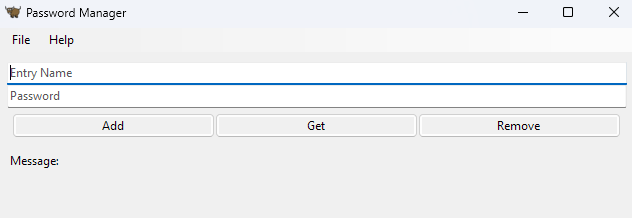

# Python. Лабораторная работа №8

## Задание

Создать приложение менеджер паролей используя GUI Toga.

## Результаты вычислений

## Список использованных источников:

1. [ChatGPT](https://chatgpt.com/)
2. [Stack Overflow](https://stackoverflow.com/)
3. [Your first Toga app](https://toga.readthedocs.io/en/latest/tutorial/tutorial-0.html)
